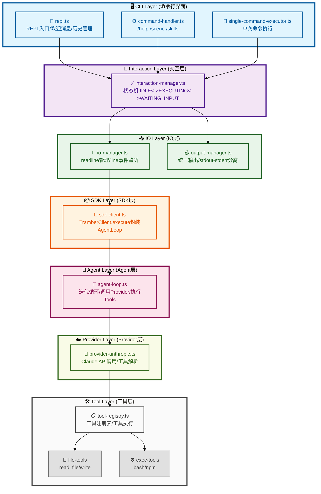
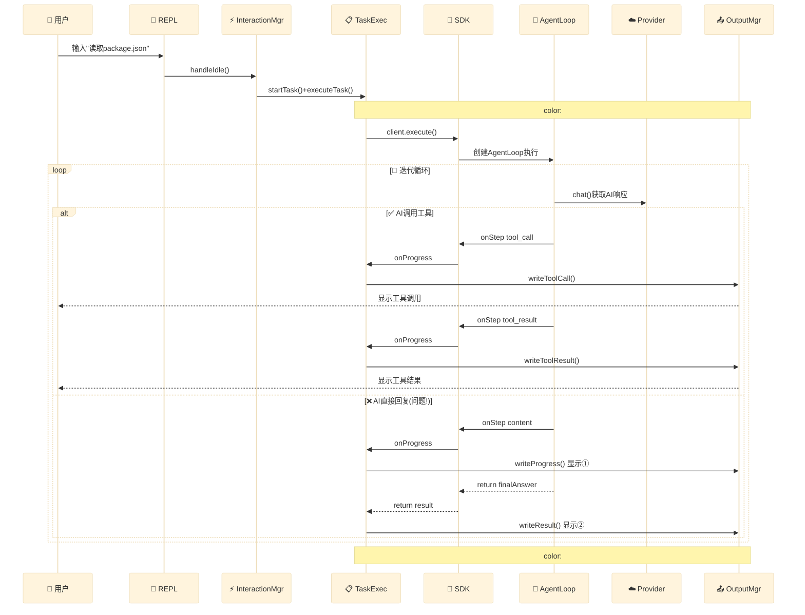
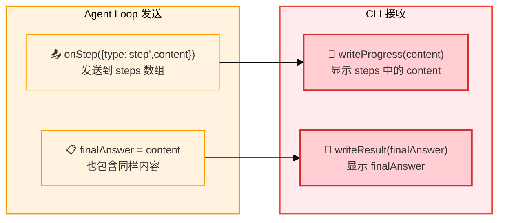
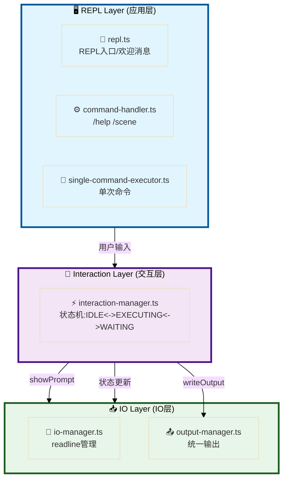
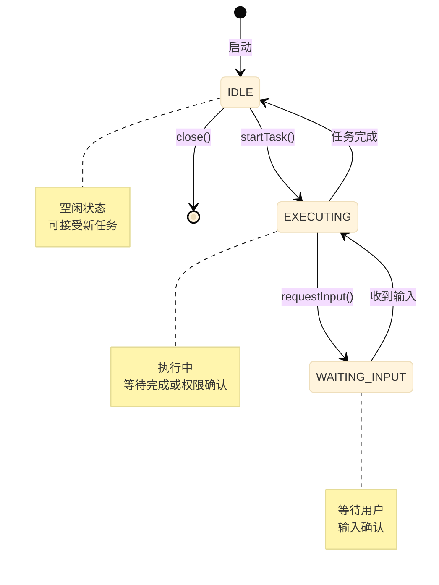

# Tramber CLI 架构图

> 本文档包含 Tramber CLI 的 Mermaid 架构图，用于更清晰地展示系统结构

---

## 1. 系统全栈架构图



---

## 2. 完整数据流图（发现问题点）



---

## 3. 问题分析：onStep 与 finalAnswer 的语义冲突

### 3.1 当前数据流



### 3.2 问题代码

```typescript
// packages/agent/src/loop.ts:260-267
return {
  success: true,
  finalAnswer: content,     // → 放入 finalAnswer
  steps: [...this.steps],  // → this.steps 也包含同样内容
};

// 同时通过 onStep 也发送了
onProgress({ type: 'step', content });
```

### 3.3 修复方案

| 方案 | 改动位置 | 修复方式 | 推荐度 |
|-----|---------|---------|--------|
| **A** | SDK | `finalAnswer` 只包含结构化数据，不包含 AI 文本 | ⭐⭐ |
| **B** | Agent Loop | AI 文本只通过 onStep 发送，**不**放入 `finalAnswer` | ⭐⭐⭐ |

> **推荐方案 B**：AI 的文本响应本质上是"进度"，不是"最终结果"。

---

## 4. CLI 三层架构图（简化版）



---

## 5. 状态机图


